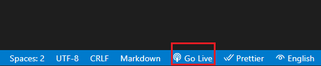

# Getting Started

1. [Installing](#installing)
1. [Running Test](#running-test)
1. [Running the Application with Live Server](#running-the-application)
1. [Adding Tests](#add-test)
1. [Adding Functionality](#adding-functionality)

## Requirements
1. Retrieve tasks
1. Create a task
1. Edit a task
1. Complete a task
1. Delete a task

## Optional Requirements

If you have completed the steps above, add tests that check for ['unhappy paths' and 'edge cases'][1]. 

Add the following functionality with the appropriate tests:

1. Reorder a task by priority number
1. Reorder a task by date
1. Reorder a task by dragging and dropping

## Installing

Once the project is open in Visual Code, first install all the dependencies in the project by running:

```bash
npm install
```

## Running Test

Then, to run your test use the following command:
```bash
npm test
```
You should be able to see the following output:


## Running the Application

This is a client-side JavaScript application. To run locally you will need a server. The fastest way to run this application is by installing the [Live Server Extension](https://marketplace.visualstudio.com/items?itemName=ritwickdey.LiveServer).

Once installed, click the `Go Live` option on the status bar to turn the server on or off.



## Adding Tests

To add tests to the project, add to the file [task.test.js](./../__test__/task.test.js). This can be found in the [__ test__](./../__test__) folder of this repository.

## Adding Functionality

To add functionality to the project, add to the  index.js file. Feel free to change the project structure or rename files.

### Task Manager Example GUI

Example interface for the Task Manager App. 


[1]:(https://cucumber.io/blog/test-automation/happy-unhappy-paths-why-you-need-to-test-both/)