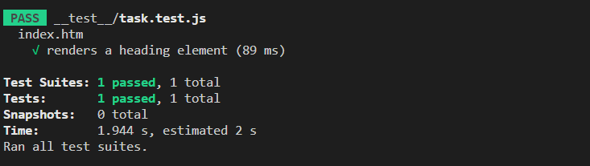
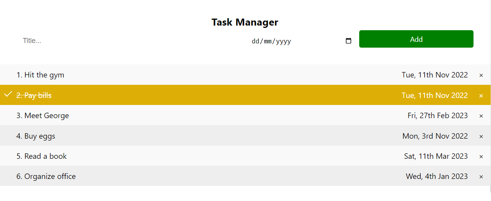

# Getting Started

## Requirements
1. Retrieve tasks
1. Create a task
1. Edit a task
1. Complete a task
1. Delete a task

## Optional Requirements

If you have completed the steps above, add tests that check for ['unhappy paths' and 'edge cases'][1]. 

Add the following stretch goals with thee appropriate unit tests and edge cases:

1. Reorder a task by priority number
1. Reorder a task by date
1. Reorder a task by dragging and dropping

## Installing and Running

First install all the dependencies in the project by running:

```bash
npm install
```

Then, to run your test use the following command:
```bash
npm test
```
You should be able to see the following output:


To add tests to the project, open the file [task.test.js](./../__test__/task.test.js). This can be found in the [__ test__](./../__test__) folder of this repository.


## Task Manager Example GUI



[1]:(https://cucumber.io/blog/test-automation/happy-unhappy-paths-why-you-need-to-test-both/)